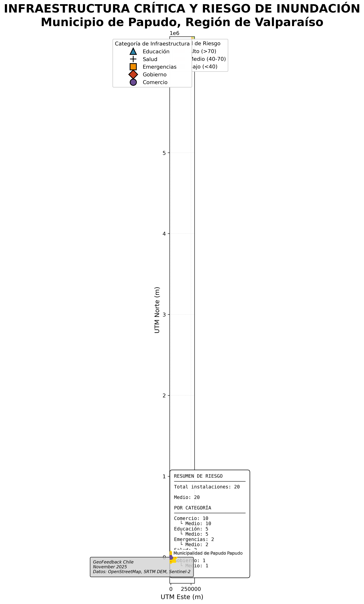

# GeoFeedback - Análisis de Riesgo de Inundación Papudo

Sistema completo de análisis geoespacial de riesgo de inundación para el municipio de Papudo, Región de Valparaíso, Chile.

[](https://railway.app)
[](https://opensource.org/licenses/MIT)
[](https://www.python.org/downloads/)
[](https://postgis.net/)



## 🌟 Características

- **Análisis Geoespacial Multi-Factor**: Combina pendiente (50%), NDVI (35%) y depresiones (15%)
- **Base de Datos PostGIS**: 2,913 polígonos de riesgo + 20 instalaciones críticas
- **API REST**: 8 endpoints con consultas espaciales optimizadas
- **Visor Web Interactivo**: Leaflet con filtros, búsqueda y clustering
- **Servicios OGC**: WMS/WFS con GeoServer para QGIS/ArcGIS
- **Despliegue Cloud**: Listo para Railway.app

## 📊 Hallazgos Principales

- **Cobertura**: 1,925 km² analizados
- **Riesgo Alto**: 23.38% (450 km²)
- **Riesgo Medio**: 44.28% (852 km²)
- **Riesgo Bajo**: 32.34% (623 km²)
- **Infraestructura en Riesgo**: 20 instalaciones en zona amarilla
  - 5 centros educativos
  - 2 centros de salud
  - 2 servicios de emergencia
  - 1 municipalidad

## 🏗️ Arquitectura

```
GeoFeedback/
├── Análisis Geoespacial (Python)
│   ├── DEM SRTM 30m
│   ├── NDVI Sentinel-2
│   └── Análisis topográfico
│
├── Base de Datos (PostGIS)
│   ├── Polígonos de riesgo
│   ├── Infraestructura crítica
│   ├── Funciones PL/pgSQL
│   └── Vistas materializadas
│
├── Backend (Flask API)
│   ├── 8 endpoints REST
│   ├── Consultas espaciales
│   └── CORS habilitado
│
├── Frontend (Leaflet + nginx)
│   ├── Mapa interactivo
│   ├── Filtros dinámicos
│   └── Búsqueda en tiempo real
│
└── Servicios OGC (GeoServer)
    ├── WMS (mapas)
    ├── WFS (features)
    └── Estilos SLD
```

## 🚀 Inicio Rápido

### Opción 1: Despliegue en Railway (Recomendado)

```bash
# 1. Fork el repositorio en GitHub

# 2. Crear cuenta en railway.app

# 3. Nuevo proyecto desde GitHub
#    - Seleccionar: theChosen16/Demo_geofeedback
#    - Railway detectará automáticamente la configuración

# 4. Agregar PostgreSQL
#    - Click "+ New Service" → Database → PostgreSQL
#    - Railway creará DATABASE_URL automáticamente

# 5. Desplegar
#    - Push a master → Deploy automático
```

📖 **Guía completa:** [deployment/RAILWAY_DEPLOYMENT.md](deployment/RAILWAY_DEPLOYMENT.md)

### Opción 2: Desarrollo Local

**Requisitos:**
- Python 3.11+
- PostgreSQL 12+ con PostGIS 3.0+
- Docker (para GeoServer)

```bash
# 1. Clonar repositorio
git clone https://github.com/theChosen16/Demo_geofeedback.git
cd Demo_geofeedback

# 2. Instalar dependencias Python
pip install -r api/requirements.txt

# 3. Configurar base de datos
createdb geofeedback_papudo
psql geofeedback_papudo -c "CREATE EXTENSION postgis;"

# 4. Migrar base de datos
python deployment/migrate_database.py

# 5. Iniciar API
cd api && python app.py
# API en: http://localhost:5000

# 6. Iniciar visor web (en otra terminal)
cd web && python -m http.server 8000
# Web en: http://localhost:8000

# 7. GeoServer (opcional)
cd geoserver && ./start.sh
# GeoServer en: http://localhost:8080/geoserver
```

## 📚 Documentación

### Componentes

- [API REST](api/README.md) - Documentación de endpoints y ejemplos
- [Visor Web](web/README.md) - Uso del mapa interactivo
- [GeoServer](geoserver/README.md) - Servicios OGC (WMS/WFS)
- [Despliegue](deployment/README.md) - Guías de producción

### Scripts de Análisis

- `scripts/analysis_flooding.py` - Análisis de riesgo multi-factor
- `scripts/create_flood_risk_map.py` - Generación de mapas
- `scripts/03_vectorize_amenaza.py` - Vectorización de rasters
- `scripts/08_analyze_infrastructure_risk.py` - Análisis de infraestructura

### Base de Datos

- `scripts/sql/01_setup_postgis_schema.sql` - Inicialización
- `scripts/sql/04_create_functions.sql` - 8 funciones PL/pgSQL
- `scripts/sql/05_create_views.sql` - Vistas materializadas

## 🔧 API Endpoints

### Base URL
- **Desarrollo**: `http://localhost:5000`
- **Producción**: `https://geofeedback-api.up.railway.app`

### Endpoints Principales

```bash
# Health check
GET /api/v1/health

# Estadísticas de riesgo
GET /api/v1/stats

# Riesgo en punto específico
GET /api/v1/risk/point?lon=-71.4492&lat=-32.5067

# Infraestructura completa
GET /api/v1/infrastructure

# Infraestructura por riesgo
GET /api/v1/infrastructure/risk/2

# Infraestructura por categoría
GET /api/v1/infrastructure/category/Educación
```

**Ejemplos completos:** [api/README.md](api/README.md)

## 🗺️ Servicios OGC

### WMS (Web Map Service)

```
GetCapabilities:
http://localhost:8080/geoserver/geofeedback/wms?service=WMS&request=GetCapabilities

GetMap:
http://localhost:8080/geoserver/geofeedback/wms?
  service=WMS&version=1.1.0&request=GetMap
  &layers=geofeedback:amenaza_poligonos
  &bbox=-71.50,-32.54,-71.42,-32.47
  &width=800&height=600&srs=EPSG:4326
  &format=image/png
```

### WFS (Web Feature Service)

```
GetFeature (GeoJSON):
http://localhost:8080/geoserver/geofeedback/wfs?
  service=WFS&version=2.0.0&request=GetFeature
  &typeName=geofeedback:amenaza_poligonos
  &outputFormat=application/json
```

## 💻 Tecnologías

### Backend
- **Python 3.11** - Lenguaje principal
- **Flask 3.0** - Framework web
- **PostgreSQL 16** - Base de datos
- **PostGIS 3.4** - Extensión espacial
- **GeoServer 2.24** - Servidor de mapas

### Frontend
- **Leaflet 1.9.4** - Mapas interactivos
- **Leaflet.markercluster** - Agrupación de marcadores
- **Font Awesome 6.4** - Iconos
- **nginx alpine** - Servidor web

### Análisis
- **Rasterio** - Procesamiento de rasters
- **GeoPandas** - Análisis vectorial
- **GDAL** - Transformaciones geoespaciales
- **NumPy** - Cálculos numéricos

### DevOps
- **Docker** - Containerización
- **Docker Compose** - Orquestación local
- **Railway.app** - Despliegue cloud
- **GitHub Actions** - CI/CD (opcional)

## 📁 Estructura del Proyecto

```
Demo_geofeedback/
├── api/                      # API REST Flask
│   ├── app.py               # Aplicación principal
│   ├── config.py            # Configuración
│   ├── Dockerfile           # Container para Railway
│   └── requirements.txt     # Dependencias Python
│
├── web/                      # Visor web
│   ├── index.html           # Página principal
│   ├── css/style.css        # Estilos
│   ├── js/map.js            # Lógica de mapa
│   ├── nginx.conf           # Configuración nginx
│   └── Dockerfile           # Container estático
│
├── geoserver/                # GeoServer Docker
│   ├── docker-compose.yml   # Orquestación
│   ├── styles/              # Estilos SLD
│   ├── scripts/             # Automatización
│   └── init/                # Scripts SQL
│
├── scripts/                  # Análisis geoespacial
│   ├── analysis_flooding.py
│   ├── 08_analyze_infrastructure_risk.py
│   └── sql/                 # Scripts SQL
│
├── data/                     # Datos procesados
│   ├── processed/           # Resultados de análisis
│   ├── infrastructure/      # Datos OSM
│   └── raw/                 # Datos originales (gitignore)
│
├── deployment/               # Configuración de despliegue
│   ├── RAILWAY_DEPLOYMENT.md
│   ├── migrate_database.py
│   └── README.md
│
├── outputs/                  # Mapas generados
│   ├── Mapa_Infraestructura_Riesgo_Papudo.png
│   └── Mapa_Infraestructura_Riesgo_Papudo.pdf
│
└── Documentacion/            # Documentación del proyecto
    ├── 00_INDICE_Y_RESUMEN.md
    └── QUICK_START_PROTOTIPO.md
```

## 🧪 Testing

```bash
# Test de API
cd api && python test_api.py

# Test de conexión PostgreSQL
python deployment/migrate_database.py

# Test de GeoServer
cd geoserver/scripts && ./setup_geoserver.sh
```

## 🤝 Contribuir

1. Fork el proyecto
2. Crear rama feature (`git checkout -b feature/NuevaCaracteristica`)
3. Commit cambios (`git commit -m 'Agregar NuevaCaracteristica'`)
4. Push a la rama (`git push origin feature/NuevaCaracteristica`)
5. Abrir Pull Request

## 📝 Licencia

Este proyecto está bajo la Licencia MIT - ver [LICENSE](LICENSE) para detalles.

## 👥 Autores

**GeoFeedback Chile**
- GitHub: [@theChosen16](https://github.com/theChosen16)

## 🙏 Agradecimientos

- **Datos**: OpenStreetMap contributors, SRTM DEM, Sentinel-2 ESA
- **Tecnologías**: Leaflet, PostGIS, GeoServer, Flask
- **Hosting**: Railway.app

## 📞 Contacto

- **Email**: geofeedback@tudominio.cl
- **GitHub Issues**: [theChosen16/Demo_geofeedback/issues](https://github.com/theChosen16/Demo_geofeedback/issues)

---

⭐ Si este proyecto te fue útil, considera darle una estrella en GitHub!

**Última actualización:** Noviembre 2025
